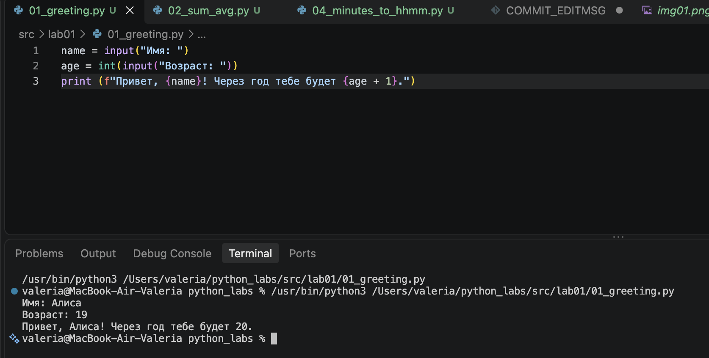
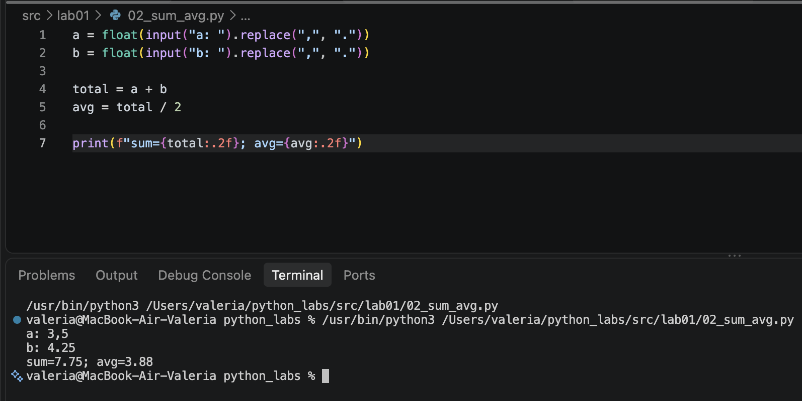
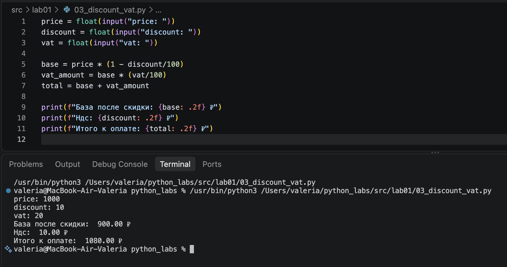
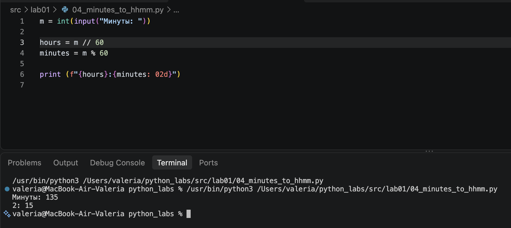
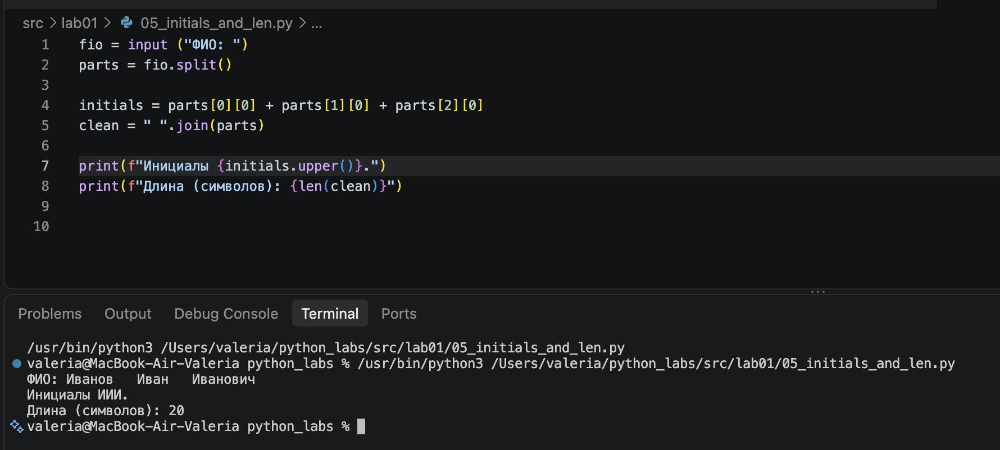
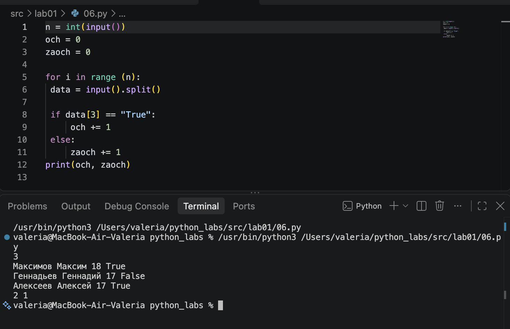

# Лабараторная работа №1
## Задание 1
 
  Определяется возраст человека через один год на основе введённых имени и текущего возраста.

## Задание 2
 
  Для двух введённых чисел находятся их общая сумма и среднее арифметическое.

## Задание 3
  
  Рассчитывается конечная стоимость товара после применения скидки и добавления НДС.

## Задание 4
 
  Указанное количество минут преобразуется в соответствующее количество часов и минут.

## Задание 5
 
 Из введённого ФИО формируются инициалы, а также подсчитывается количество символов после удаления лишних пробелов.

## Задание 6
 
 По данным участников определяется, сколько человек выбрали очное обучение, а сколько — заочное.

