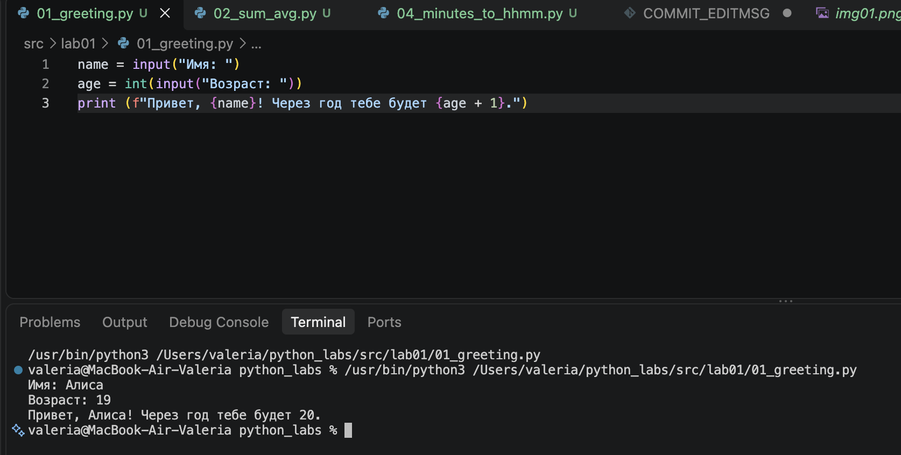
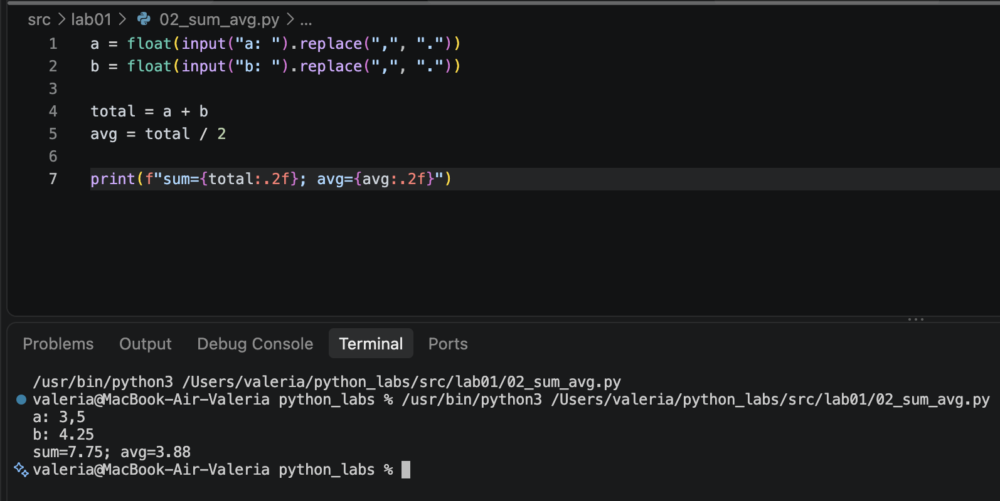
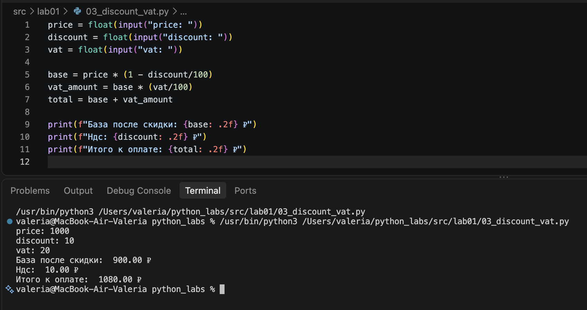
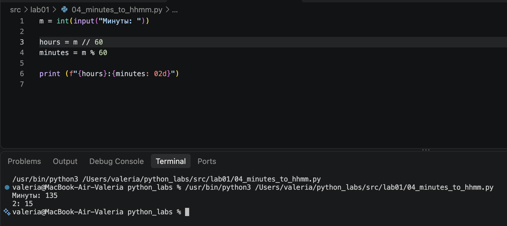
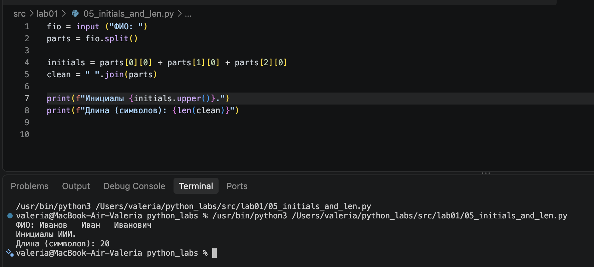
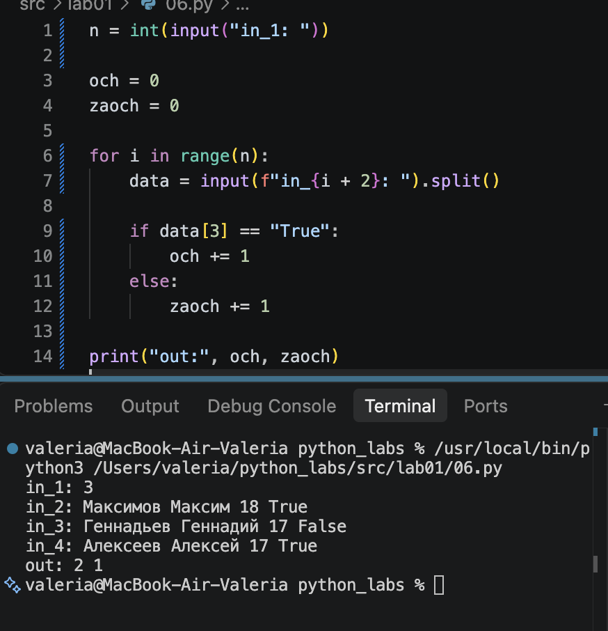

# Лабораторная работа №1
## Задание 1
 
  Определяется возраст человека через один год на основе введённых имени и текущего возраста.

## Задание 2
 
  Для двух введённых чисел находятся их общая сумма и среднее арифметическое.

## Задание 3
  
  Рассчитывается конечная стоимость товара после применения скидки и добавления НДС.

## Задание 4
 
  Указанное количество минут преобразуется в соответствующее количество часов и минут.

## Задание 5
 
 Из введённого ФИО формируются инициалы, а также подсчитывается количество символов после удаления лишних пробелов.

## Задание 6
 
 По данным участников определяется, сколько человек выбрали очное обучение, а сколько — заочное.

#Лабораторная работа №2
## Задание 1
 [1 задание](images/lab02/arrays01.png)
 По списку чисел находятся минимальное и максимальное значения, удаляются повторяющиеся элементы и выполняется сортировка, а вложенные списки объединяются в один.
 

## Задание 2
 [2 задание](images/lab02/matrix02.png)
 Для матрицы выполняется транспонирование, а также подсчитываются суммы элементов каждой строки и каждого столбца.

## Задание 3
 [3 задание](images/lab02/tuples03.png)
 Из записи студента формируются фамилия и инициалы, удаляются лишние пробелы и выводится группа и GPA с округлением до двух знаков.

