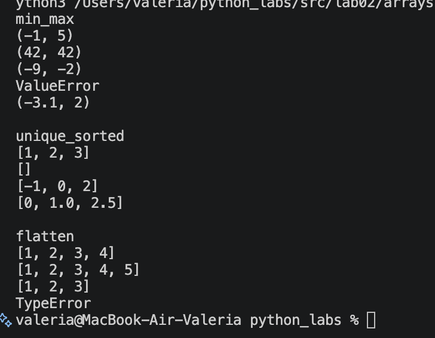
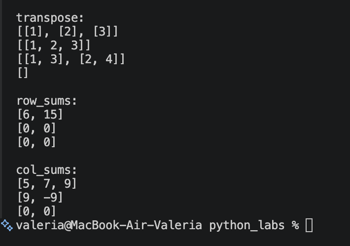
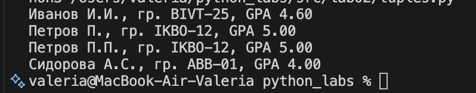

# Лабораторная работа №2
## Задание 1 
```python 
def min_max(nums: list[float | int]) -> tuple[float | int, float | int]:
    # Проверяем список на пустоту
    if not nums:
        raise ValueError("Список чисел не должен быть пустым")

    minimum = nums[0]
    maximum = nums[0]

    # Ищем минимальное и максимальное значения
    for x in nums[1:]:
        if x < minimum:
            minimum = x
        if x > maximum:
            maximum = x

    return minimum, maximum


def unique_sorted(nums: list[float | int]) -> list[float | int]:
    result = []

    # Добавляем только уникальные числа
    for x in nums:
        if x not in result:
            result.append(x)

    # Сортируем список вручную
    for i in range(len(result)):
        for j in range(len(result) - 1 - i):
            if result[j] > result[j + 1]:
                result[j], result[j + 1] = result[j + 1], result[j]

    return result


def flatten(mat: list[list | tuple]) -> list:
    result = []

    # Проверяем каждую строку матрицы
    for row in mat:
        if not isinstance(row, (list, tuple)):
            raise TypeError("Элемент матрицы должен быть списком или кортежем")

        for x in row:
            result.append(x)

    return result

print('\nmin_max')
print(min_max([3, -1, 5, 5, 0]))
print(min_max([42]))
print(min_max([-5, -2, -9]))
print(min_max([1.5, 2, 2.0, -3.1]))

try:
    min_max([])
except ValueError as e:
    print(f"ValueError: {e}")

print('\nunique_sorted')
print(unique_sorted([3, 1, 2, 1, 3]))
print(unique_sorted([]))
print(unique_sorted([-1, -1, 0, 2, 2]))
print(unique_sorted([1.0, 1, 2.5, 2.5, 0]))

print('\nflatten')
print(flatten([[1, 2], [3, 4]]))
print(flatten([[1, 2], (3, 4, 5)]))
print(flatten([[1], [], [2, 3]]))

try:
    flatten([[1, 2], "ab"])
except TypeError as e:
    print(f"TypeError: {e}")


```
 
 
 По списку чисел находятся минимальное и максимальное значения, удаляются повторяющиеся элементы и выполняется сортировка, а вложенные списки объединяются в один.
 


## Задание B
```python
```python
print("\ntranspose:")
print(transpose([[1, 2, 3]]))
print(transpose([[1], [2], [3]]))
print(transpose([[1, 2], [3, 4]]))
print(transpose([]))

try:
    transpose([[1, 2], [3]])
except ValueError as e:
    print(f"ValueError: {e}")


print("\nrow_sums:")
print(row_sums([[1, 2, 3], [4, 5, 6]]))
print(row_sums([[-1, 1], [10, -10]]))
print(row_sums([[0, 0], [0, 0]]))

try:
    row_sums([[1, 2], [3]])
except ValueError as e:
    print(f"ValueError: {e}")


print("\ncol_sums:")
print(col_sums([[1, 2, 3], [4, 5, 6]]))
print(col_sums([[-1, 1], [10, -10]]))
print(col_sums([[0, 0], [0, 0]]))

try:
    col_sums([[1, 2], [3]])
except ValueError as e:
    print(f"ValueError: {e}")

```
 
 
 Для матрицы выполняется транспонирование, а также подсчитываются суммы элементов каждой строки и каждого столбца.


## Задание C
```python
def format_record(rec: tuple[str, str, float]) -> str:
    """Форматирует запись студента в виде строки."""

    if not isinstance(rec, tuple):
        raise TypeError("Запись должна быть кортежем")

    if len(rec) != 3:
        raise ValueError("В кортеже должно быть 3 элемента")

    fio, group, gpa = rec

    if not isinstance(fio, str) or not isinstance(group, str):
        raise TypeError("ФИО и группа должны быть строками")

    if not isinstance(gpa, float):
        raise TypeError("GPA должен быть числом float")

    fio = " ".join(fio.strip().split())
    group = group.strip()

    if not fio or not group:
        raise ValueError("ФИО и группа не должны быть пустыми")

    if gpa < 0.0 or gpa > 5.0:
        raise ValueError("GPA должен быть от 0.0 до 5.0")

    parts = fio.split()

    if len(parts) < 2 or len(parts) > 3:
        raise ValueError("ФИО должно содержать 2 или 3 слова")

    surname = parts[0].capitalize()

    initials = ""
    for name in parts[1:]:
        initials += name[0].upper() + "."

    return f"{surname} {initials}, гр. {group}, GPA {gpa:.2f}"


print(format_record(("Иванов Иван Иванович", "BIVT-25", 4.6)))
print(format_record(("Петров Пётр", "IKBO-12", 5.0)))
print(format_record(("Петров Пётр Петрович", "IKBO-12", 5.0)))
print(format_record(("  сидорова  анна   сергеевна ", "ABB-01", 3.999)))
```
 
 
 Из записи студента формируются фамилия и инициалы, удаляются лишние пробелы и выводится группа и GPA с округлением до двух знаков.


